## Custom Lenses for the AWS Well-Architected Tool

**What is AWS Well-Architected?**
  - The AWS Well-Architected Framework describes key concepts, design principles, and architectural best practices for designing and running workloads in the cloud.
  - AWS Well-Architected helps cloud architects build secure, high-performing, resilient, and efficient infrastructure for various applications and workloads.
  - Built around six pillars
     
      - Operational excellence,      
      - Security,      
      - Reliability,      
      - Performance efficiency,    
      - Cost optimization, and      
      - Sustainability
 
  - AWS Well-Architected provides a consistent approach for customers and partners to evaluate architectures and implement scalable designs.

**What is AWS Well-Architected tool?**
  - The AWS WA Tool is designed to help you review the state of your applications and workloads and provide a central place for architectural best practices and guidance.
  - The AWS WA Tool is based on the AWS Well-Architected Framework, which is developed to help cloud architects build secure, high-performing, resilient, and efficient application infrastructures.
  - AWS solutions architects have used the Framework in tens of thousands of workload reviews. It provides a consistent approach for evaluating your cloud architecture and implementing designs that will scale with your application needs over time.
  - You can review workloads against best practices across the architectural pillars of operational excellence, security, reliability, performance efficiency, and cost optimization.
  - The AWS WA Tool delivers a list of issues found in your workloads and step-by-step guidance to improve.
  - You can also view the issues found across the portfolio of workloads. AWS recommend performing a workload review at significant milestones in your development cycle.
 
      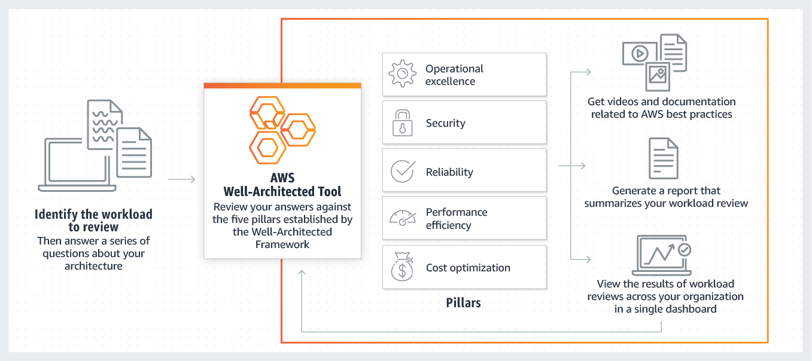

**What is Custom Lens for the AWS Well-Architected Tool?**
  - In addition to the standard guidance provided by the AWS WA Framework and AWS developed lenses, the AWS WA Tool allows you to now add specific best practice guidance using custom lenses.
  - By developing your questions and evaluating your workloads using your organization’s best practices, you can perform reviews based on technology or governance requirements specific to your industry.
 
**Benefits of leveraging AWS Well-Architected Tool**
  - Access knowledge and best practices used by AWS solutions architects whenever you need it. Answer questions about your application or workload, and the AWS WA Tool delivers an action plan with step-by-step guidance on areas for improvement.
  - The AWS WA Tool provides a single tool and consistent process to review and measure your cloud architectures. The tool allows you to monitor the status of multiple workloads across your organization and helps you understand potential risks. With the action plan, you can identify the next steps for improvement, drive architectural decisions, and build for the cloud with confidence.
  - The AWS WA Tool supports continuous improvement throughout the workload lifecycle. The tool makes it easy to save point-in-time milestones and track changes to your workload. Initiate new reviews as desired to help ensure your architecture improves over time.
  - With the AWS WA Tool, you can create custom lenses and share them across your entire organization to measure workloads consistently. Specify rules to help you determine which options can result in high or medium risk and provide guidance on resolving those risks.

**What can we do with a custom lens?**
  - Viewing custom lenses: You can view the details of custom lenses that you own or the custom lenses that have been shared with you.
  - Creating a custom lens: You can create custom lenses that you can apply to your workload.
  - Publishing a custom lens for the first time: Publish so that it can be applied to workloads or shared with other AWS accounts or IAM users.
  - Publishing an update to a custom lens: You can modify existing published custom lenses
  - Sharing a custom lens: You can share custom lenses with up to 300 AWS accounts or IAM users.
  - Deleting a custom lens:  You can delete the custom lenses that you have defined.
  - Lens format specification: Lenses are defined using a specific JSON format. And it defines the structure for the pillars, questions, best practices, and improvement plan
 
**Tutorial**
  -  This tutorial walks you through creating a custom lens for the AWS Well-Architected Tool.
 
  - Step 1: Prerequisite
   
     -  <a href="https://github.com/sanchitdilipjain/aws-reinvent-2021-updates/blob/main/docs/resources/custom-lense-war/custom_lens_template.json">Download</a> the sample Lens specification json file for this tutorial which contains pillars, questions, best practices, and improvement plan.

  - Step 2: Create a custom lens
 
     - Traverse to the <a href="https://console.aws.amazon.com/wellarchitected/">AWS Well-Architected Tool console</a>
     
        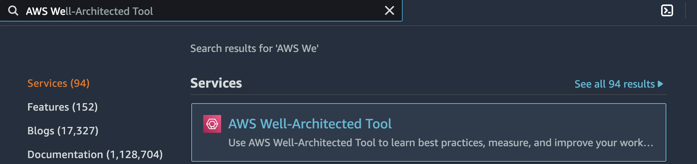
       
     - Select Custom lenses from the left navigation bar
     
        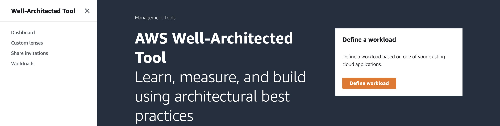
     
     - Click Create custom lens and upload the sample Lens specification json file downloaded under the Prerequisite stage.

        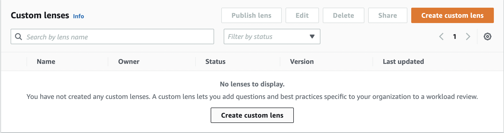
       
        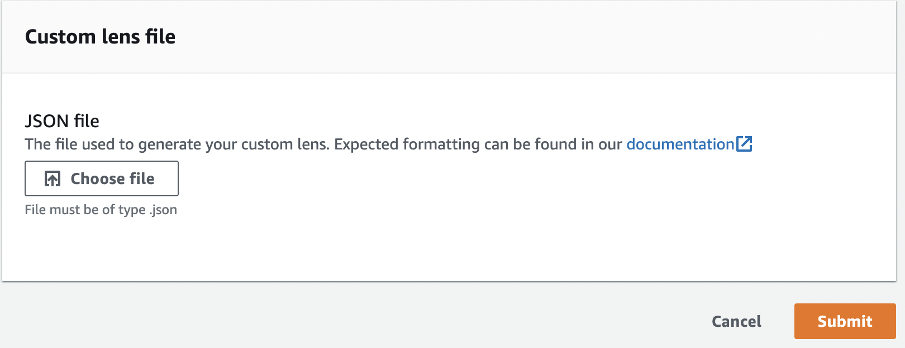
     
     - Click Submit, after submitting lens, it is in the draft which needs to be published so we can apply it to our workload
       
        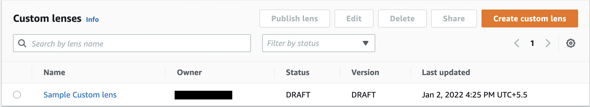

  - Step 3: Publish a custom lens
 
     -  Select the lens under the draft mode, and we are looking to publish. Click Publish
       
        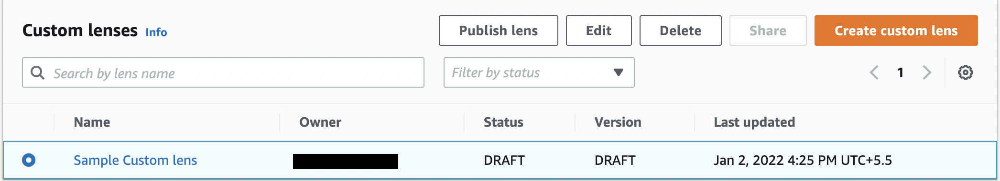  
     
     -  Next, provide the version name, and click Publish
       
        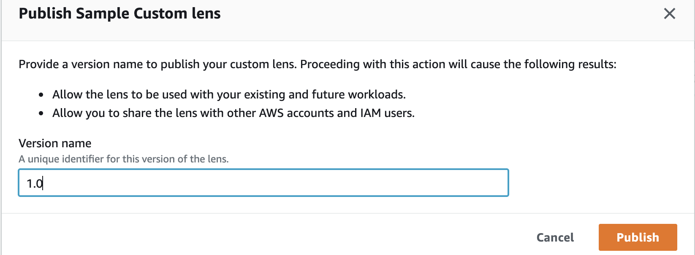
       
        

  - Step 4: Share a custom lens
   
    -  Select the lens which is published mode, and we are looking to share. Click Share
       
        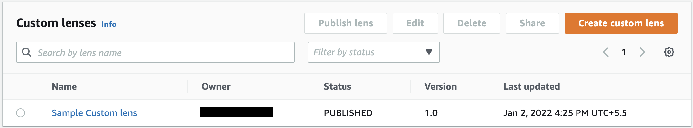
       
    -  Provide Account-Id under IAM Principals. Click Create, once they accept the invitation, a lens will be available with the shared account
       
        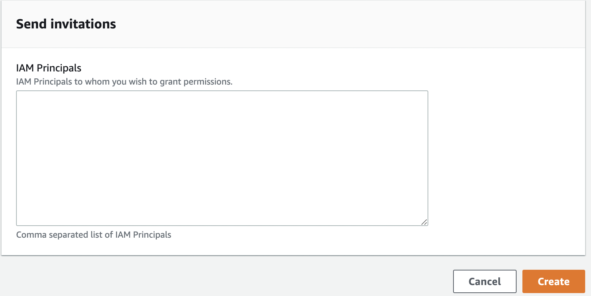
   
       **Note**: Shared accounts may continue to access and use your shared custom lenses even if you delete the custom lenses from your AWS account or terminate your AWS account

  - Step 5: Delete a custom lens
   
    -  Select the lens under drafted/published mode, and we are looking to delete it. Click Delete
       
        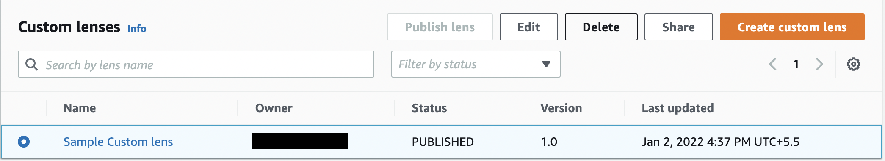
   
    - Provide the confirmation, and click Delete    
       
        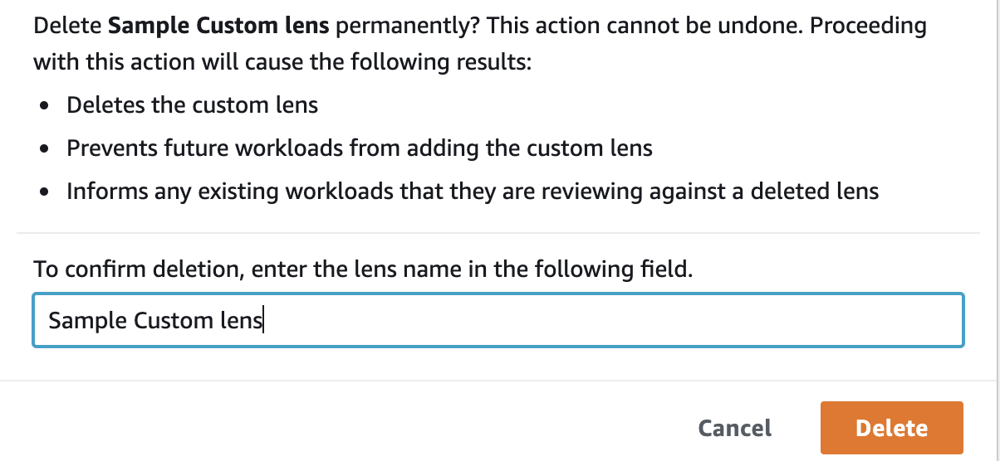
