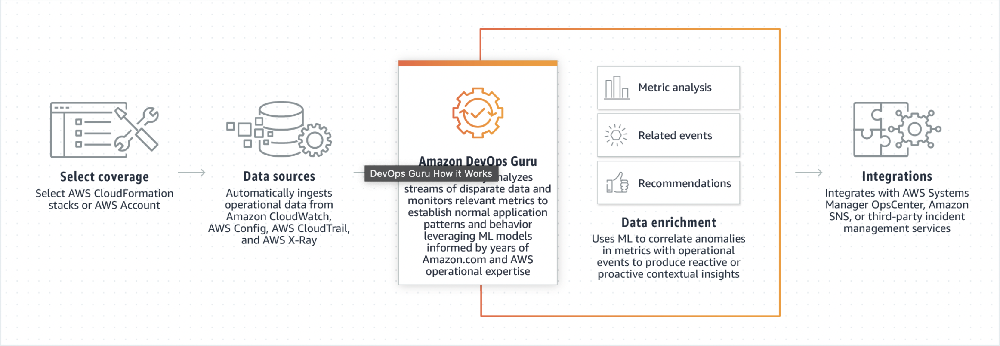
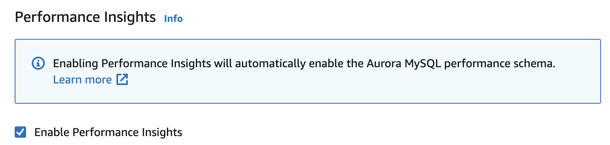
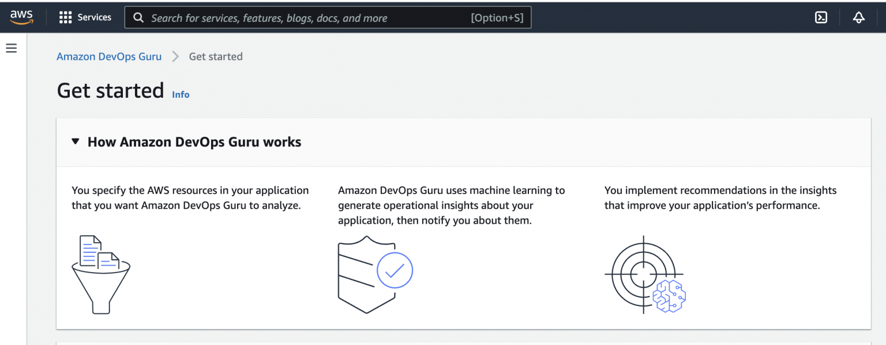
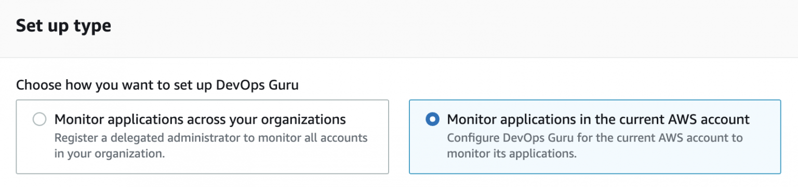
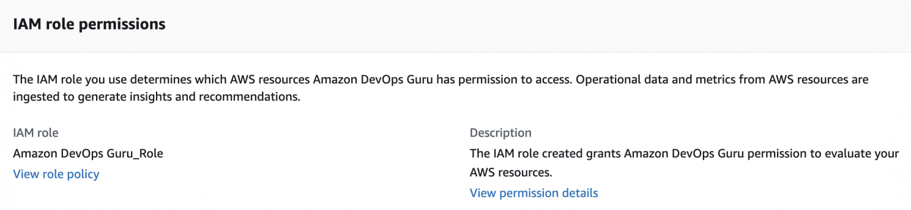
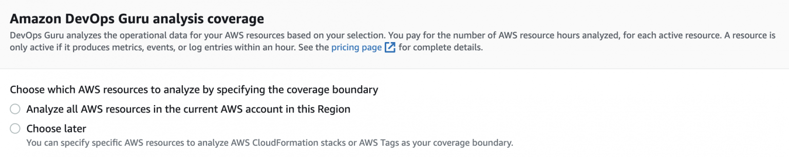
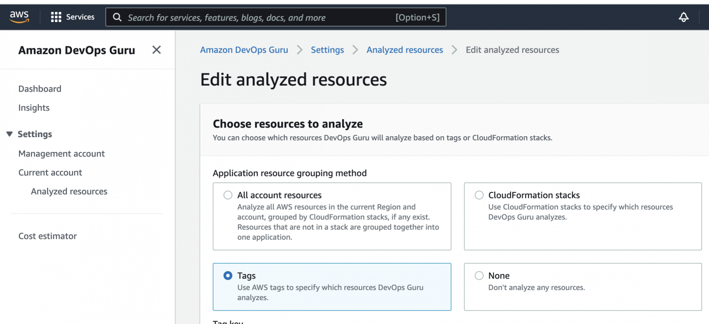
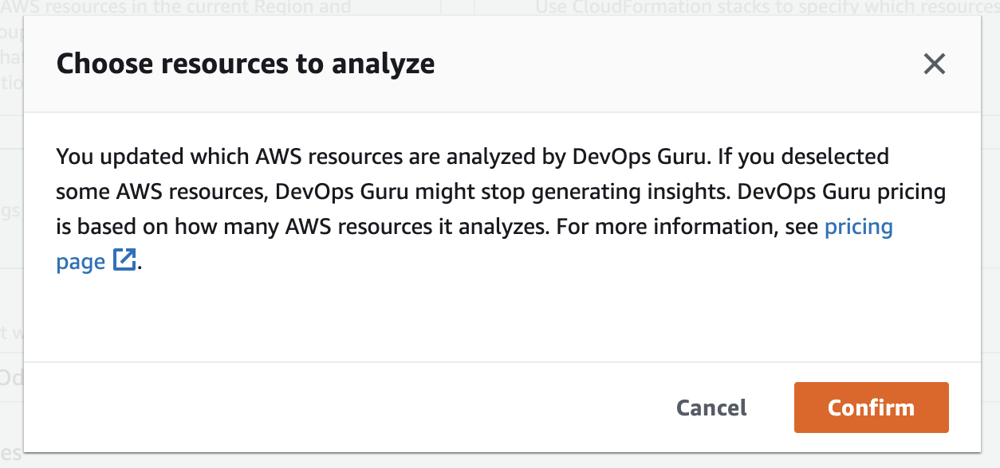

**What is DevOps Guru for RDS?**
  - DevOps Guru for RDS is a new ML-powered capability empowering developers and DevOps engineers to quickly detect, diagnose, and remediate a wide variety of database-related issues on Amazon RDS. 
  - When DevOps Guru for RDS detects a database-related issue (such as resource overutilization, or misbehavior of certain SQL queries), the service immediately notifies you and provides diagnostic information, details on the extent of the problem, and intelligent recommendations to quickly resolve the issue. 
  - With DevOps Guru for RDS, you can monitor your databases for performance bottlenecks and operational issues without any manual setup, ML expertise, or deep database expertise required. 
  - DevOps Guru for RDS currently supports Amazon Aurora MySQL-Compatible Edition and Amazon Aurora PostgreSQL-Compatible Edition, with expanded support for additional RDS database engines coming later.

      

**Integration with Amazon EventBridge**

  - Amazon DevOps Guru integrates with Amazon EventBridge to notify you of certain events relating to insights and corresponding insight updates. Events from AWS services are delivered to EventBridge in near real time. 
  - We can write simple rules to indicate which events are of interest to you and what automated actions to take when an event matches a rule. The actions that can be automatically initiated include the following examples:
    - Invoking an AWS Lambda function
    - Invoking an Amazon Elastic Compute Cloud run command
    - Relaying the event to Amazon Kinesis Data Streams
    - Activating a Step Functions state machine
    - Notifying an Amazon SNS or an Amazon SQS

  - You can select any of the following predefined patterns to filter events or create a custom pattern rule to initiate actions in a supported AWS resources.
    - DevOps Guru New Insight Open
    - DevOps Guru New Anomaly Association
    - DevOps Guru Insight Severity Upgraded
    - DevOps Guru New Recommendation Created
    - DevOps Guru Insight Closed

**Benefits:**
  - **Detect and diagnose RDS database performance bottlenecks and operational issues**. DevOps Guru for RDS continuously analyzes database telemetry, such as database load, database counters, and operating system metrics on the database, to automatically detect and correlate related anomalies and help resolve relational database issues in minutes.
      
  - **Natively integrate with AWS services to automatically receive notifications**. When DevOps Guru for RDS detects a performance bottleneck or operational issue, it displays its findings in the Amazon DevOps Guru console and sends notifications through AWS services, such as Amazon EventBridge and Amazon Simple Notification Service (SNS). This allows developers to automatically manage and take real-time action on performance and operational issues before they become customer-impacting outages.
    
  - **Reduce time to resolution from days to minutes**. With DevOps Guru for RDS, you can quickly understand the cause of a performance or operational problem without searching through hundreds of database metrics. With intelligent recommendations and remediation steps, developers and DevOps engineers can resolve issues in minutes without enlisting help from database experts.

**Tutorial**

- This tutorial walks you through enabling DevOps Guru for Amazon Aurora. 

  - Step 1: Enabling Performance Insights for your Amazon Aurora DB instances
    - As a prerequisite, you must use an Aurora RDS instance that is large enough to enable Performance Insights.
    - If you don't enable Performance Insights, or don't see this option on your RDS Aurora instance, you cannot use DevOps Guru for RDS

      

    - By default, it is disabled and you need to enable it. When you enable it, you have a few more features:

  - Step 2: Configuring access policies for DevOps Guru for RDS
    - After you have enabled Performance Insights, you should enable DevOps Guru.

      

    - When enabling it you should select whether you would like to monitor your current account, or additional accounts in your organization

      

    - It will generate a new IAM Role in your account:

      

    - And you will have to choose whether you would like to analyze all your resources, or specific ones. If you are not sure, select 'Choose later'

      

  - Step 3: Adding Amazon Aurora DB instances to your DevOps Guru coverage
    - When you enabled DevOps Guru, you should point to analyze your Aurora RDS. You can do that by creating a new tag

      

    - Please note that you pay per resource when using DevOps Guru

      

    - That's all. Now you should wait until AWS DevOps guru completes the analysis:

      
