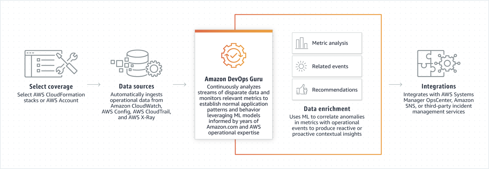

Amazon DevOps Guru for RDS, powered by machine learning (ML) and available for all Amazon Relational Database Service (RDS) engines, helps make it easy to improve an application’s operational performance and availability

**What is it?**
  - DevOps Guru for RDS is a new ML-powered capability empowering developers and DevOps engineers to quickly detect, diagnose, and remediate a wide variety of database-related issues on Amazon RDS. 
  - When DevOps Guru for RDS detects a database-related issue (such as resource overutilization, or misbehavior of certain SQL queries), the service immediately notifies you and provides diagnostic information, details on the extent of the problem, and intelligent recommendations to quickly resolve the issue. 
  - With DevOps Guru for RDS, you can monitor your databases for performance bottlenecks and operational issues without any manual setup, ML expertise, or deep database expertise required. 
  - DevOps Guru for RDS currently supports Amazon Aurora MySQL-Compatible Edition and Amazon Aurora PostgreSQL-Compatible Edition, with expanded support for additional RDS database engines coming later.

    

**Benefits:**
  - Detect and diagnose RDS database performance bottlenecks and operational issues. DevOps Guru for RDS continuously analyzes database telemetry, such as database load, database counters, and operating system metrics on the database, to automatically detect and correlate related anomalies and help resolve relational database issues in minutes.
  - Natively integrate with AWS services to automatically receive notifications. When DevOps Guru for RDS detects a performance bottleneck or operational issue, it displays its findings in the Amazon DevOps Guru console and sends notifications through AWS services, such as Amazon EventBridge and Amazon Simple Notification Service (SNS). This allows developers to automatically manage and take real-time action on performance and operational issues before they become customer-impacting outages.
  - Reduce time to resolution from days to minutes. With DevOps Guru for RDS, you can quickly understand the cause of a performance or operational problem without searching through hundreds of database metrics. With intelligent recommendations and remediation steps, developers and DevOps engineers can resolve issues in minutes without enlisting help from database experts.
