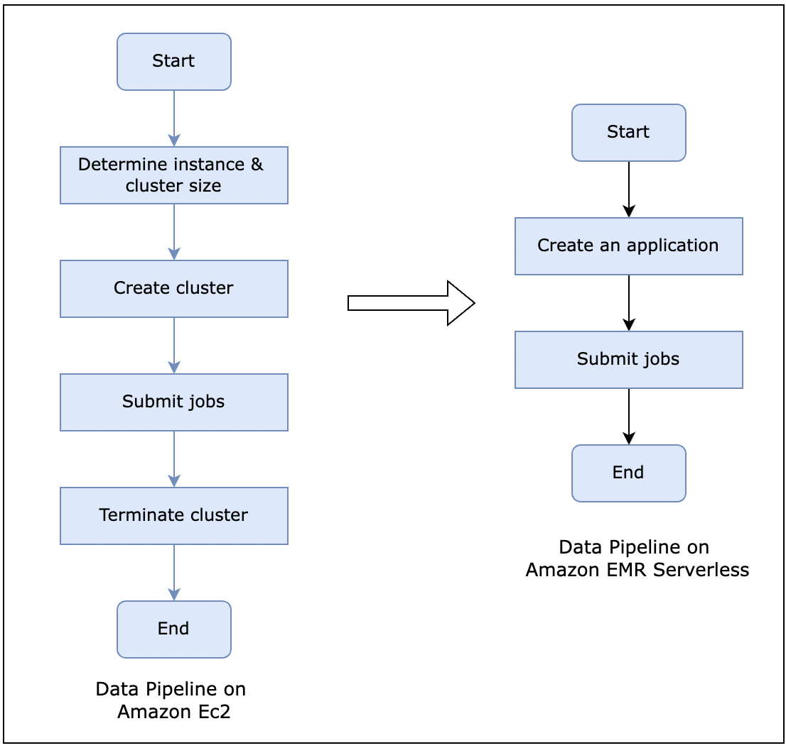

## Amazon EMR Serverless

**What is Amazon EMR?**
- Amazon EMR is a cloud big data platform for running large-scale distributed data processing jobs, interactive SQL queries, and machine learning (ML) applications using open-source analytics frameworks such as Apache Spark, Apache Hive, and Presto.
- Understanding clusters and nodes
  - A cluster is a collection of Amazon Elastic Compute Cloud (Amazon EC2) instances. Each instance in the cluster is called a node. Each node has a role within the cluster, referred to as the node type. Amazon EMR also installs different software components on each node type, giving each node a role in a distributed application like Apache Hadoop.
  - The node types in Amazon EMR are as follows:
    - **Master node**: A node that manages the cluster by running software components to coordinate the distribution of data and tasks among other nodes for processing. The master node tracks the status of tasks and monitors the cluster's health. Every cluster has a master node, and it's possible to create a single-node cluster with only the master node.
    - **Core node**: A node with software components that run tasks and store data in your cluster's Hadoop Distributed File System (HDFS). Multi-node clusters have at least one core node.
    - **Task node**: A node with software components that only runs tasks and does not store data in HDFS. Task nodes are optional
 
      

**What is Amazon EMR Serverless?**
  - Amazon EMR Serverless is a serverless option on Amazon EMR that makes it easy for data analysts and engineers to run open-source big data analytics frameworks without configuring, managing, and scaling clusters or servers. You get all the features and benefits of Amazon EMR without the need for experts to plan and manage clusters.
  - Amazon EMR Serverless automatically provisions and scales the compute and memory resources required by your applications, and you only pay for the resources that the applications use.

**Amazon EMR Serverless Core concepts**
  - **Application**:  With EMR Serverless, you can create one or more applications that use open-source analytics frameworks. To create an application, you specify the open-source framework that you want to use (for example, Apache Spark or Apache Hive), the Amazon EMR release for the open-source framework version (for example, Amazon EMR release 6.4, which corresponds to Apache Spark 3.1.2), and a name for your application. After you create an application, you can submit data processing jobs or interactive requests to your application
  - **Job**: A job is a request submitted to an EMR Serverless application that is asynchronously run and tracked through completion. You can run multiple jobs concurrently in an application.
  - **Workers**: An EMR Serverless application internally uses workers to run your jobs. Depending on the open-source framework, EMR Serverless uses a default number of VCPU, memory, and local storage per worker. You can override these defaults for your application.
  - **Pre-initialized workers**: Pre-initialized workers allow you to maintain a warm pool of workers for the application so that it can provide a sub-second response to start processing requests.

**How Amazon Ec2 based Data pipeline differs compared to Amazon EMR Serverless?**

  

**Benefits:**
- **Run frameworks more easily:**. Select the open-source framework you want to run for your application, such as Apache Spark, Hive, or Presto, and
EMR Serverless automatically provisions and manages the underlying compute and memory resources.
- **Scale on demand:**. Run analytics workloads at any scale with automatic on-demand scaling that resizes resources in seconds to meet changing data
volumes and processing requirements.
- **Optimize costs:**. EMR Serverless automatically scales resources up and down to provide just the right capacity for your application. You pay only
for what you use, and you can minimize concerns about over-or under-provisioning.

**Use cases:**
- **Variable workloads:**. As workload demands change, scale application resources seamlessly without preconfiguring how much compute and
memory you need.
- **Interactive data analysis:**. Choose the option to pre-initialize application resources and enable sub-second response time for interactive data analysis in
EMR Studio.
- **Development and test environments:**. Spin up a development and test environment quickly and easily, automatically scale with unpredictable usage, and
get products to market faster.
