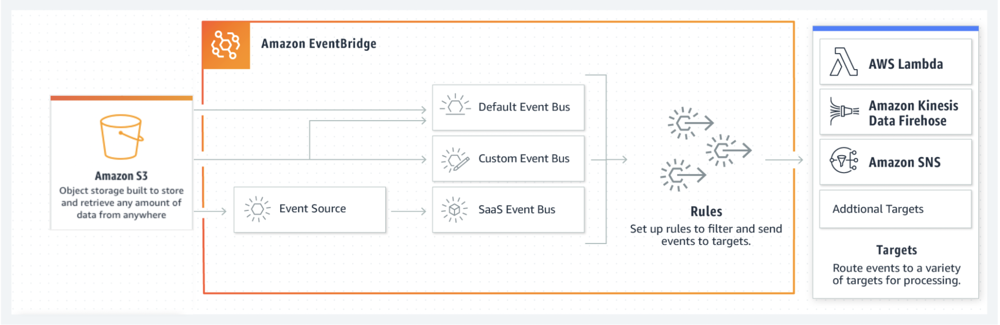

## Amazon S3 Event Notifications with Amazon EventBridge

**What is Amazon Simple Storage Service (S3)?**
- Amazon S3 is one of the main building blocks of AWS. It’s advertised as ”infinitely scaling” storage. It’s widely popular and deserves its own section
- S3 provides unlimited storage space and works on the pay-as-you-use model. Service rates get cheaper as the usage volume increases
- Amazon S3 allows people to store objects (files) in “buckets” (directories). S3 resources for e.g. buckets and objects are private by default

**Amazon S3 Event Notifications with Amazon EventBridge**

- We can now use Amazon S3 Event Notifications with Amazon EventBridge to build, scale, and deploy event-driven applications based on changes to the data you store on Amazon S3. 
- This makes it easier to act on new data in Amazon S3, build multiple applications that react to object changes simultaneously, and replay past events, all without creating additional copies of objects or developing new software. 
- With increased flexibility to process events and send them to multiple targets, you can now more confidently create new serverless applications with advanced analytics and machine learning (ML) at scale without writing single-use custom code.
- We can start sending S3 Event Notifications to EventBridge with a few clicks in the AWS Management Console or with a single API request
- **Benefits**:
  - Use advanced filtering and routing capabilities and send events to 18 targets, including AWS Lambda, Amazon Kinesis, AWS Step Functions, and Amazon Simple Queue Service (SQS).
  - Simplify your architecture by matching any attribute, or a combination of attributes, for objects in an S3 event. This allows you to filter events by object size, time range, or other event metadata fields before invoking a target Lambda function or other destination. For example, if millions of audio files are uploaded to an S3 bucket, you can filter for specific files and send an event notification to multiple workflows. Through these multiple workflows, the same event can be used to transcribe an audio file, change its media format for streaming, and apply ML to generate a sentiment score.
  - Archive and replay S3 events to reprocess an event in case of an error or if a new application module is added.
- **Use cases**:
  - Easily build and deploy event-driven applications without custom software.
  - Act on new data in S3 faster, make changes to event-driven applications without interruptions, and debug by replaying past events.
  - Use the largest set of destinations on the internet with API destinations.
  
      

**Tutorial**
- This tutorial walks you through creating an Amazon S3 Event Notifications with Amazon EventBridge.

 
