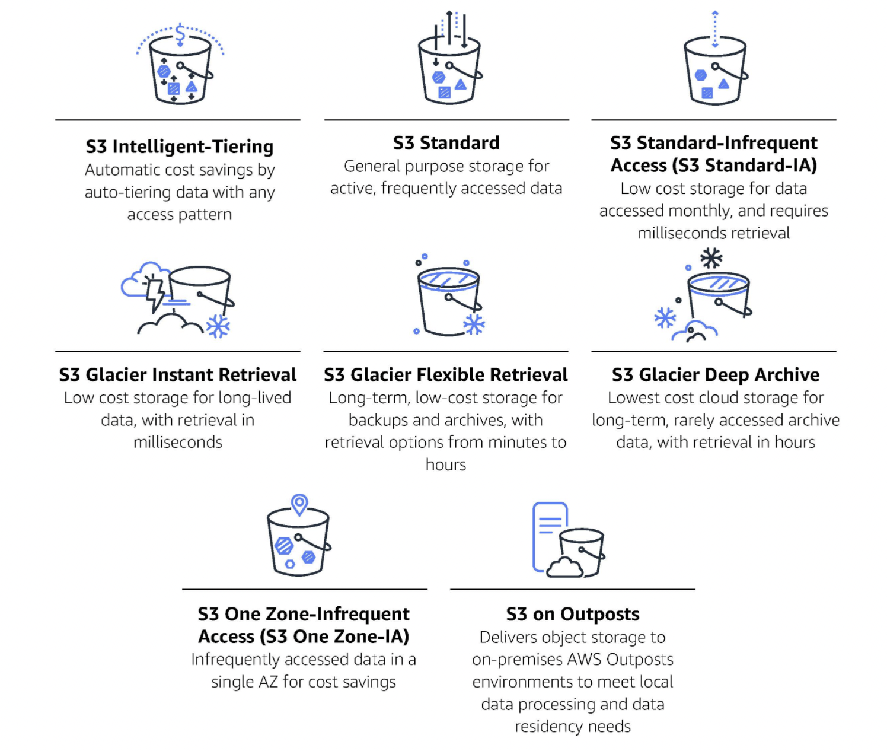
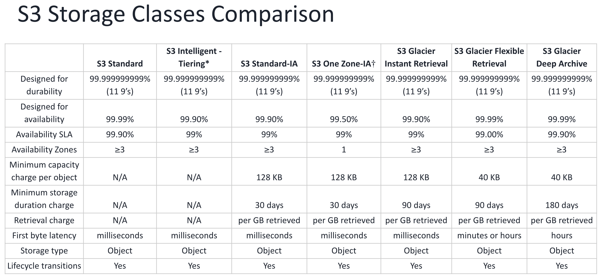

## Amazon S3 Intelligent-Tiering: Archive Instant Access tier

**What is Amazon Simple Storage Service (S3)?**
- Amazon S3 is one of the main building blocks of AWS. It's advertised as" infinitely scaling" storage. It's widely popular and deserves its section
- S3 provides unlimited storage space and works on the pay-as-you-use model. Service rates get cheaper as the usage volume increases
- Amazon S3 allows people to store objects (files) in "buckets" (directories). S3 resources, e.g., buckets and objects, are private by default

**What are different storage classes?**
- Amazon S3 offers a range of storage classes that you can choose from based on your workloads' data access, resiliency, and cost requirements.
- S3 storage classes are purpose-built to provide the lowest cost storage for different access patterns

  

**Amazon S3 Intelligent-Tiering: Archive Instant Access tier**

- The Amazon Simple Storage Service (S3) Intelligent-Tiering storage class now automatically includes a new Archive Instant Access tier with cost savings of up to 68% for rarely accessed data that needs milliseconds retrieval high-throughput performance.
- Amazon S3 Intelligent-Tiering is the first cloud storage that automatically reduces your storage costs on a granular object level by automatically moving data to the most cost-effective access tier based on access frequency—without performance impact, retrieval fees, or operational overhead.
- S3 Intelligent-Tiering delivers milliseconds latency and high-throughput performance for frequently, infrequently, and now rarely accessed data in the Frequent, Infrequent, and new Archive Instant Access tiers.
- We can now use S3 Intelligent-Tiering as the default storage class for virtually any workload, especially data lakes, analytics, new applications, and user-generated content.
- **Benefits**:
  - **Automatic storage cost savings**. S3 Intelligent-Tiering delivers
automatic storage cost savings by moving data to lower-cost storage access tiers based on access patterns. The longer data is not accessed, the more you save—up to 68% in the automatic tiers.
  - **Retrieval in milliseconds**. In all three automatic Access tiers, your data is delivered in milliseconds.
  - **Lowest storage cost in the cloud**. By opting into asynchronous archive capabilities for objects that are rarely accessed, you can realize storage cost savings of up to 95%, with the lowest storage cost in the cloud.
  - **Simple**. There is no operational overhead, no lifecycle charges, no retrieval charges, and no minimum storage duration.
  - **Unmatched durability and scalability**. S3 Intelligent-Tiering runs on the world's largest global cloud infrastructure with virtually unlimited scalability and is designed for 99.999999999% (11 nines) durability. Data is automatically distributed across multiple Availability Zones (AZs) geographically separated within a Region.
- **Use cases**:
  - S3 Intelligent-Tiering is the default storage class for virtually any workload, especially data lakes, analytics, new applications, and user-generated content.
  - Any use case or workload with unknown, unpredictable, or changing access patterns is ideal for S3 Intelligent-Tiering, allowing you to save on storage costs automatically.

**Performance across the S3 Storage Classes**
 
  
